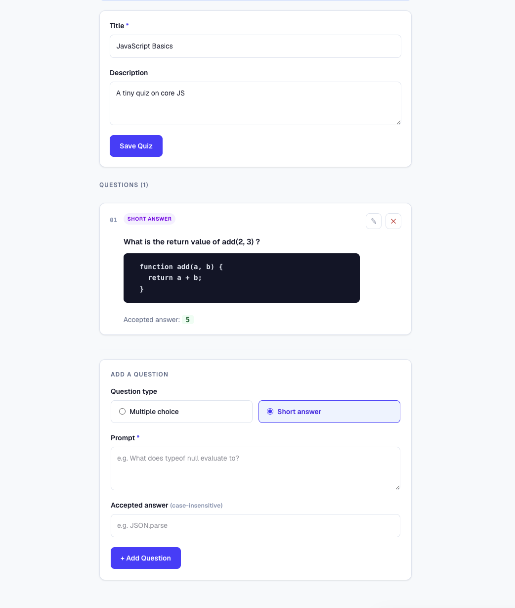
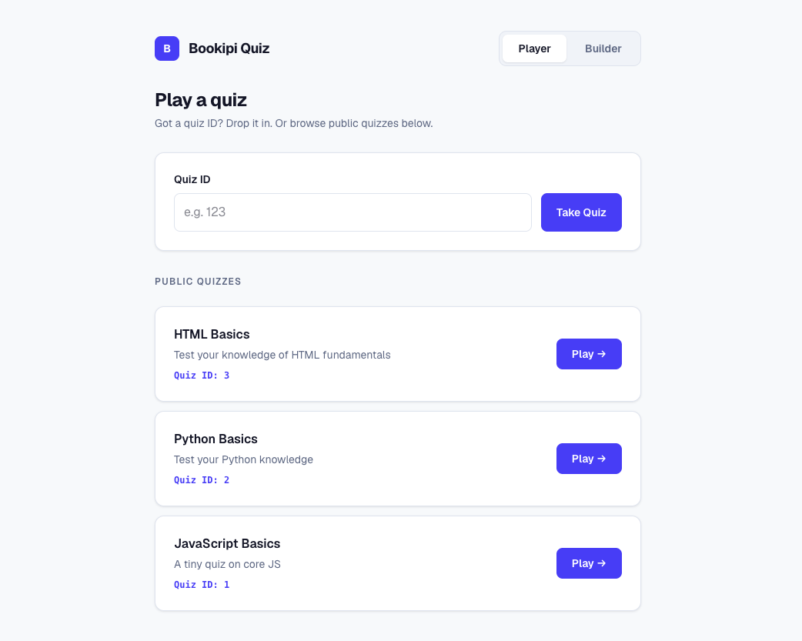
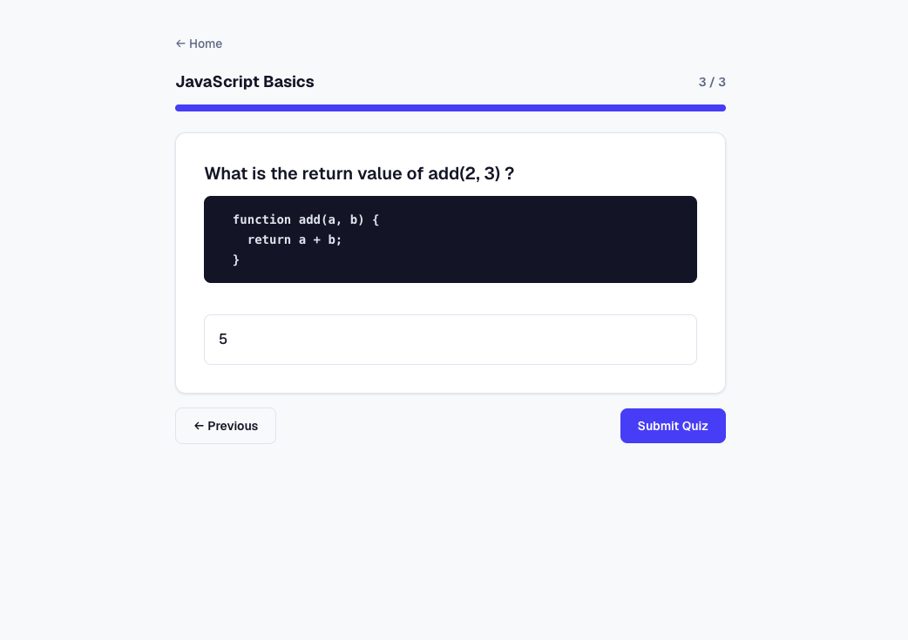
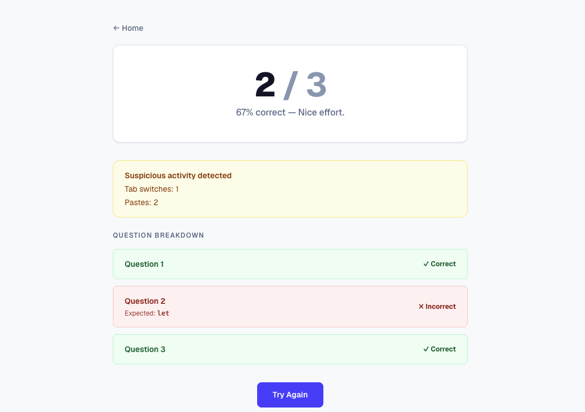

# Bookipi Quiz

A quiz builder and player app built with React. Create quizzes with MCQ, short-answer, and code-prompt questions, then take them with live scoring.

**Live demo:** [bookipi-quiz.hiday.dev](http://bookipi-quiz.hiday.dev/)

> **Note:** This repo contains a pre-built backend (`/backend`) provided as a drop-in API. No changes were made to the backend — all implementation work is in the frontend (`/src`).

## Screenshots

| Builder                                 | Player                                |
| --------------------------------------- | ------------------------------------- |
|  |  |

| Quiz                              | Results                                 |
| --------------------------------- | --------------------------------------- |
|  |  |

## Frontend stack

|               | Tech                       |
| ------------- | -------------------------- |
| Framework     | React 19, TypeScript, Vite |
| Styling       | Tailwind CSS v4            |
| Data fetching | TanStack Query v5, Axios   |
| Forms         | React Hook Form            |
| Routing       | React Router v7            |
| Testing       | Vitest, Testing Library    |

## Project structure

```
bookipi-quiz/
├── src/
│   ├── api/              # Axios client + endpoint functions
│   ├── components/       # Shared UI components
│   ├── context/          # QuizContext (active quiz state)
│   ├── hooks/            # useAntiCheat, etc.
│   ├── pages/            # Route-level page components
│   ├── queries/          # TanStack Query hooks
│   └── types.ts          # Shared TypeScript types
├── backend/              # Pre-built Express + SQLite API (unchanged)
└── public/
```

## Getting started

### 1. Start the backend

The backend is a pre-built Express + SQLite server. See [backend/README.md](backend/README.md) for full details.

```bash
cd backend
npm install
cp .env.example .env    # default token: dev-token, port: 4000
npm run seed            # initialize DB with sample data
npm run dev             # http://localhost:4000
```

### 2. Start the frontend

```bash
# from repo root
yarn install
cp .env.example .env    # fill in VITE_API_TOKEN to match backend
yarn dev                # http://localhost:5173
```

### Environment variables

```env
VITE_API_URL=http://localhost:4000   # backend base URL
VITE_API_TOKEN=                      # must match API_TOKEN in backend/.env
VITE_API_TIMEOUT=10000               # axios timeout in ms
```

**Want to skip running the backend locally?** Point the frontend at the hosted demo API instead:

```env
VITE_API_URL=https://quiz-api.hiday.dev
VITE_API_TOKEN=dev-token
```

## Routes

| Path                | Description                             |
| ------------------- | --------------------------------------- |
| `/quiz`             | Home — browse published quizzes to take |
| `/build`            | Home — browse quizzes to edit           |
| `/builder`          | Create a new quiz                       |
| `/builder/:id`      | Edit an existing quiz                   |
| `/quiz/:id`         | Quiz detail / start screen              |
| `/quiz/:id/play`    | Quiz player (timed, anti-cheat)         |
| `/quiz/:id/results` | Score and answer breakdown              |

## Architecture decisions

- **Code snippets in the prompt** — the backend has no dedicated field for code snippets, just `prompt`. So instead of changing the backend contract, code snippets are embedded in the prompt using triple backticks. `PromptDisplay` picks that up and renders it as a styled code block. Plain text stays as-is.

- **TanStack Query for server state** — all API data goes through the query cache. After a mutation, the relevant query is invalidated so the UI just refetches — no manual state syncing needed.

- **Context for quiz state** — holds the active attempt, answers, and result. localStorage was ruled out because the API can't restore a previous attempt, so a refresh always restarts.

- **One page for create and edit** — `QuizBuilderPage` handles both. When there's no `id` param it's create mode; after saving it redirects to `/builder/:id` where question management shows up. Same component, two modes.

- **Context split into two files** — to keep HMR working. Vite hot-reloads break if a file mixes component and non-component exports, so the context instance lives in `useQuizContext.ts` and the provider in `QuizContext.tsx`.

## Anti-cheat

Implemented as a `useAntiCheat` hook, active during quiz play.

Tracks two signals during quiz play:

- **Tab switches** — via `visibilitychange`, logs `window_blur` / `window_focus` to the backend
- **Pastes** — via `paste` on `document`, logs `copy_paste_detected` to the backend

Events are sent in real time to `POST /attempts/:id/events`. There's no API to read them back, so the counts are tracked in local state inside the hook, passed through `QuizContext`, and shown as a warning banner on the results page if anything was detected.

## Scripts

```bash
yarn dev         # start dev server
yarn build       # type-check + production build
yarn preview     # preview production build locally
yarn test        # run tests once
yarn test:watch  # run tests in watch mode
yarn lint        # run ESLint
yarn prettier    # format all files with Prettier
```
